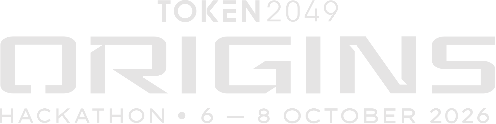

# Wallet QA at TOKEN2049 ORIGINS — draft 10-slide outline

Audience: Cardano hackathon judges. Goal: show an evidence-backed wallet QA service, Cardano's commercial role, current proof, and the exact remaining milestone. Distinguish verified work from planned integration on every relevant slide. Use the existing Wallet QA sage, forest, and lime brand. Place the Wallet QA and TOKEN2049 ORIGINS logos together at the bottom right on every slide. Do not use `wallet-qa-handoff/pitch-deck/` as a content or design reference.

## Slide 1 — Hire a wallet QA agent. Get evidence for every result.

- **Role:** Cover and product promise.
- **Key points:** Small Web3 teams are the first buyer; a short request becomes agreed tests and inspectable evidence; hook: “The button is not the proof.”
- **Visual idea:** Oversized product statement, restrained browser/wallet/chain motif, both required logos at bottom right.

## Slide 2 — Wallet journeys fail between browser, wallet, and chain

- **Role:** Customer problem.
- **Key points:** A successful chain transaction can coexist with a failed UI expectation; manual QA struggles to reconcile the three surfaces; buyers need reproducible findings, not a screenshot count.
- **Visual idea:** Three evidence lanes converging on one disputed outcome.

## Slide 3 — Agree on the test before the agent spends

- **Role:** Product difference.
- **Key points:** Buyer states URL and goal; agent builds a longer pool of planning questions, then Laya scores usefulness and checks wording. Buyer sees up to ten at a time; required fields take priority and unclear questions are rewritten. Buyer approves assertions, fixed service fee, separate test funds, and signing limits before execution. Laya's review is advisory.
- **Visual idea:** Adapt flowchart 1 (“From QA request to inspectable evidence”) into one readable graph. Keep green code, amber host/operator, gray external, and dashed manual handoffs. Label any unfinished buyer UI as a concept, not a live screen.

## Slide 4 — A five-step buyer journey

- **Role:** UX walkthrough.
- **Key points:** Request and answer ranked planning questions → approve → fund → run → report; show plain-language payment/progress states; final report offers evidence, reproduction steps, and review route.
- **Visual idea:** Five compact product frames. Use real UI only where available; label remaining frames “concept.”

## Slide 5 — The swap landed. The test failed.

- **Role:** Recorded demo case study.
- **Key points:** Browser signed one 0.01 QMS swap; receipt succeeded and 0.009915 USDC arrived; Playwright failed because the expected explorer tab did not open. Cause remains unresolved—do not claim an app defect.
- **Visual idea:** Split verdict: confirmed chain result versus failed browser assertion, each with its evidence type. Embed a presentation-ready recording in the final PPT if available.

## Slide 6 — What Cardano contributes to the purchase

- **Role:** Cardano value.
- **Key points:** Cardano/Masumi is for service identity, escrow, and payment-linked delivery; the app under test may run on another chain; one prior preprod payment locked funds but the paid QA result was not submitted. A completed end-to-end paid job is the next proof.
- **Visual idea:** Adapt flowchart 2 (“Existing Masumi escrow checkout”) as this slide's main graph, with verified versus incomplete states clearly marked. Keep the note that `ResultSubmitted` is not seller collection. A result hash does not prove the QA conclusion.

## Slide 7 — A separate direct x402 route for agent buyers

- **Role:** Second Cardano purchase route and implementation boundary.
- **Key points:** x402 quotes one approved job and binds one signed Cardano payment to it; pending retries reuse the same payment; unlike Masumi, direct x402 has no automatic escrow refund. Local tests cover the flow; live preprod settlement and automatic paid browser dispatch remain unverified.
- **Visual idea:** Adapt flowchart 3 (“Separate direct x402 checkout”) into one legible graph; simplify node text but retain quote, signed payment, pending/retry, confirmed, and trusted-host handoff branches.

## Slide 8 — Evidence before verdict

- **Role:** Technical credibility and safety.
- **Key points:** PASS requires proof; signing and recovery are bounded; missing or uncertain work stays visible as BLOCKED/INCONCLUSIVE/NOT_RUN; an app failure is useful delivery, while incomplete service delivery goes to review.
- **Visual idea:** Adapt flowchart 4 (“Evidence becomes the authoritative result”) as the main graph. Beneath it, show the final deliverable: inspectable report (`index.html` + `report-data.json`), evidence archive (`evidence.zip`), and integrity manifest (`manifest.json` with file sizes and SHA-256 hashes). Keep optional agent commentary visibly separate.

## Slide 9 — A narrow buyer, a measurable service

- **Role:** Customer value and business hypothesis.
- **Key points:** Start with small Web3 teams testing one wallet journey; replace manual cross-surface investigation; measure job time, execution cost, actionable findings, and pilot conversion. Pricing and adoption claims are hypotheses until validated.
- **Visual idea:** Buyer/problem/metric grid with “to validate” labels, no invented traction figures.

## Slide 10 — Proven today. Next: one paid QA loop.

- **Role:** Closing and concrete ask.
- **Key points:** Verified: planning/report core, wallet connection, one browser swap with reconciled chain receipt; incomplete: integrated Masumi-funded execution and buyer UX; next milestone: one approved scope → confirmed funding → bounded run → payment-linked report. Ask for a pilot team and one scoped wallet flow.
- **Visual idea:** Proven / next / pilot ask. Both logos at bottom right.

## Required source images and placement

- **Every slide:** Wallet QA logo; strict input asset; preserve the original mark; pair with the hackathon logo at bottom right.

  

- **Every slide:** TOKEN2049 ORIGINS hackathon logo; strict input asset; preserve its white artwork; pair with the Wallet QA logo at bottom right on a dark area for contrast.

  

## Required graph source and placement

Use [current-system-flowcharts.md](../wallet-qa-handoff/current-system-flowcharts.md) as the authoritative diagram source. The [simplified graph drafts](graphs.draft.md) define presentation-friendly wording and visual rules. Use **one graph per slide**:

- **Slide 3:** Chart 1 — QA request to inspectable evidence. Preserve the manual approval and execution handoffs.
- **Slide 6:** Chart 2 — Masumi escrow checkout. Preserve the distinction between locked funds, result submission, and seller collection.
- **Slide 7:** Chart 3 — Direct x402 checkout. Preserve the same-payment retry path, lack of automatic refund, and unverified live settlement.
- **Slide 8:** Chart 4 — Evidence to authoritative result. Preserve blocked finalization and the separate static report import.

The Mermaid graphs are strict **content** sources, not slide-layout references. Redraw them in the Wallet QA brand with short labels, generous spacing, and one prominent route per slide. Preserve payment distinctions, manual handoffs, and current-status claims. Keep each graph's limitation on its slide or in speaker notes.

Slide images and a PPTX already exist; these content revisions have not been rendered into them.
