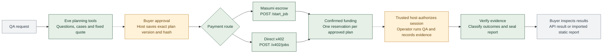
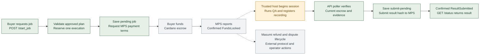
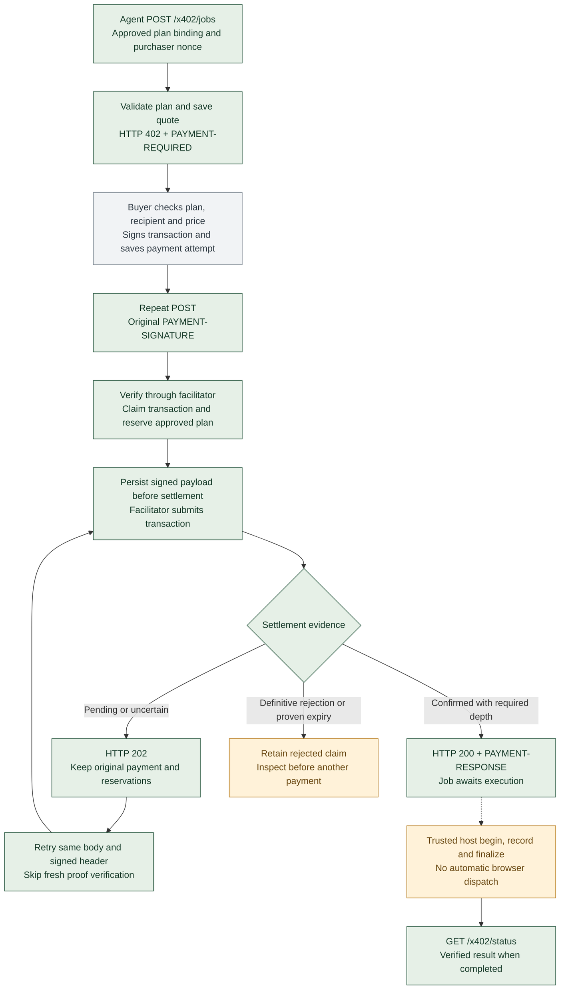
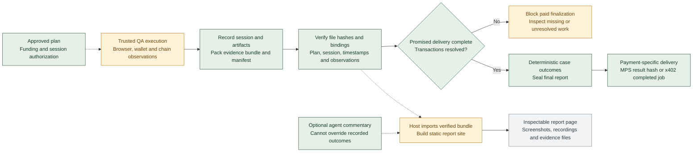

# web3lane current system flowcharts

Snapshot: 7 October 2026. Four editable Mermaid diagrams for slide-deck preparation, reflecting the current implementation. Each section supplies a slide title, diagram, and short speaker note.

**Reading key:** green = application code; amber = trusted host or operator action; gray = external system. Dashed arrows indicate manual handoffs or optional paths. Payment confirmation does not automatically launch a browser worker.

Use one chart per slide. Export a rendered chart as SVG for sharp text when resizing. Keep the limitation beneath each chart with the slide or its speaker notes.

## 1 From QA request to inspectable evidence

**Slide message:** Agree on the test, fund one approved run, deliver evidence tied to the agreed expectations.

**Speaker note:** Service payment is on Cardano preprod; the tested application can use another chain. Both checkout routes enforce the same approved-plan reservation. The planning and execution handoffs are host-controlled; a complete autonomous workflow is not implemented.

**Code anchors:** [planning](../web3lane-agent/agent/tools/build_test_plan.ts), [approved-plan store](../web3lane-agent/agent/lib/approved-plan-store.ts), [API](../web3lane-agent/agent-api.mjs), [finalization](../web3lane-agent/paid-finalization.mjs).

## 2 Existing Masumi escrow checkout

**Slide message:** Masumi holds the service payment in escrow while the service produces a verifiable result.

**Speaker note:** `ResultSubmitted` completes the API job; it does not by itself mean escrow funds have been released to the seller. Refunds and disputes remain in the Masumi lifecycle. The diagram does not imply a new automatic refund endpoint or review UI. Unknown payment/result-write outcomes require inspection before replay, and expired submission deadlines block finalization.

**Code anchors:** [MPS checkout and poller](../web3lane-agent/agent-api.mjs), [trusted recording commands](../web3lane-agent/record-paid-run.mjs), [escrow and evidence checks](../web3lane-agent/paid-finalization.mjs).

## 3 Separate direct x402 checkout

**Slide message:** An agent discovers the price over HTTP, signs one payment, and receives one paid job.

**Speaker note:** This is a direct transfer to the service, with no automatic escrow refund. A refund requires a separate operator-approved transfer; refund-transfer automation is not included. The x402 flow never creates an MPS payment or submits an MPS result. A payment cannot be reused for another job, and the shared plan reservation prevents buying the same plan through both routes. Status polling is free.

**Current limits:** Preprod only; enabled by `X402_PAY_TO`; one API process per local journal. Restart recovery relies on durable settlement tracking at the configured facilitator. Local tests cover the HTTP/SDK flow with payment fixtures; live Cardano settlement remains unverified.

**Decision:** Keep direct x402 and Masumi escrow separate. The installed Cardano SDK's x402 escrow signatures cannot use the existing MPS lifecycle. See the [recorded technical decision](../web3lane-agent/README.md#decision-separate-cardano-x402-checkout-2026-10-07).

**Code anchors:** [checkout](../web3lane-agent/x402-checkout.mjs), [buyer helper](../web3lane-agent/x402-client.mjs), [trusted x402 commands](../web3lane-agent/record-x402-run.mjs), [HTTP restart test](../web3lane-agent/x402-http.test.mjs).

## 4 Evidence becomes the authoritative result

**Slide message:** Recorded observations and verified files determine outcomes; model commentary remains separate.

**Speaker note:** Finding an application defect can still be successful QA delivery. Missing critical work or unresolved transactions cannot be presented as complete paid delivery. Static report publication is a separate host import/build step; the report site does not fetch payment state at runtime. A visible report is not proof of payment completion.

**Code anchors:** [recording and finalization](../web3lane-agent/paid-finalization.mjs), [outcome runner](../web3lane-agent/agent/lib/runner.ts), [report sealing](../web3lane-agent/agent/lib/report.ts), [evidence verifier](../web3lane-agent/scripts/evidence-bundle.mjs), [report import](../web3lane-agent/scripts/import-evidence-report.mjs), [static report site](../web3lane-reports/README.md).

## Claims to preserve in the deck

| Safe claim | Boundary to keep visible |
| --- | --- |
| Two separate ways to purchase an approved QA run | Masumi escrow and direct x402 have different refund behavior |
| Payment and execution are tied to a stored approved plan | Approval is persisted by the trusted host |
| x402 retries reuse one signed payment | Live settlement still needs preprod validation |
| Evidence checks determine the sealed paid result | Browser work remains a trusted-runner handoff |
| Buyers can inspect exported evidence | Static report import/build is separate from API job completion |

Earlier handoff documents describe intended architecture as well as implementation. These charts use the current API, checkout, recording and report code; they do not depict a production job queue, deployed payment service, autonomous refund workflow, or automatic paid browser execution.
