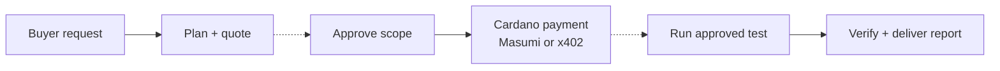
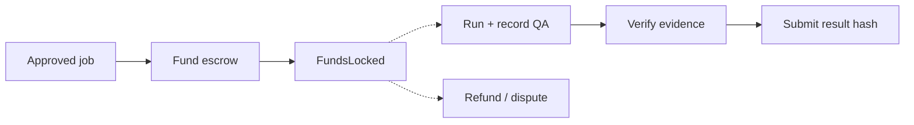
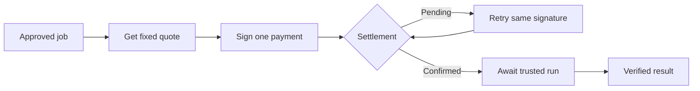
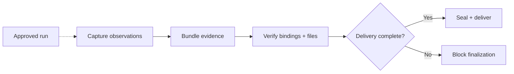

# Slide graph drafts

Adapted from [current-system-flowcharts.md](../web3lane-handoff/current-system-flowcharts.md). These are simplified content drafts for slides, not final slide art. Preserve the source's state boundaries and caveats in captions or speaker notes.

## Visual rules

- One left-to-right idea per slide, with 5–7 prominent nodes and generous space.
- Rounded cards, thin forest-green connectors, sage background, lime for the decisive state or outcome.
- Green = application code; amber = trusted host/operator; gray = external buyer, wallet, or protocol. Dashed line = manual handoff. Do not print color names in the slide legend.
- Short verb-led labels; no code paths, API route names, or paragraphs inside boxes. Put precise terms in one short caption below the graph.
- Align nodes on a grid and use a single branch only when it changes the meaning. Pair the web3lane and TOKEN2049 ORIGINS logos at bottom right, separate from graph content.

## Slide 3 — From request to report

**Caption:** Approval and execution require trusted host/operator handoffs. Payment confirmation does not launch the browser automatically. Both payment routes reserve the same approved plan.

## Slide 6 — Masumi escrow

**Caption:** Cardano holds the service payment. `ResultSubmitted` is not proof that the seller collected funds or that the QA conclusion is correct. The prior preprod payment reached `FundsLocked`, but its result was not submitted.

## Slide 7 — Direct x402 purchase

**Caption:** This is a direct Cardano transfer, separate from Masumi escrow. No automatic refund. Local tests cover the flow; live preprod settlement and automatic browser dispatch remain unverified.

## Slide 8 — Evidence decides the result

**Caption:** Missing work or unresolved transactions block paid finalization. Optional agent commentary cannot change recorded outcomes. Static report publication is a separate host import/build step; a visible report alone does not prove payment completion.

**Slide content below graph:** Inspectable report (`index.html`, `report-data.json`); evidence archive (`evidence.zip` with screenshots, recording, RPC proof, and logs); integrity manifest (`manifest.json` with file sizes and SHA-256 hashes).
